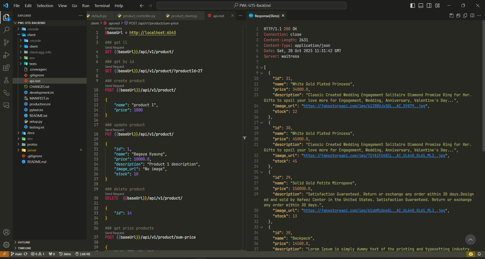

# PWL UTS BackEnd

## Author

- 120140194 - Muhammad Elang Permadani

## Tech Stack

- Python 3.11.x
- Pyramind 2.0.x
- Grpcio 1.41.x
- Grpcio-tools 1.41.x
- Sqlalchemy 1.4.x
- alembic 1.7.x
- mysqlclient 2.1.x

## How to run

- Make sure you have python 3.11.x or higher installed

```bash
python3 --version
```

- Clone this repository

```bash
git clone https://github.com/maybeenang/PWL-UTS-BackEnd.git
```

- Change directory

```bash
cd PWL-UTS-BackEnd
```

### Generate gRPC and run gRPC server

- Change directory to `server`

```bash
cd server
```

- Make venv

```bash
python3 -m venv env
```

- Activate venv

```bash
.\env\Scripts\activate
```

- Upgrade pip and setuptools

```bash
.\env\Scripts\python.exe -m pip install --upgrade pip setuptools
```

- Install requirements

```bash
.\env\Scripts\pip.exe -e .
```

- Generate gRPC

```bash
.\env\Scripts\python.exe -m grpc_tools.protoc -I../protos --python_out=. --pyi_out=. --grpc_python_out=. ../protos/products.proto
```

- Migrate database
  note: make sure you have mysql server running and your database has been created, to see what database name you should use, see `server\alembic.ini`

```bash
.\env\Scripts\alembic.exe upgrade head
```

- Run gRPC server

```bash
.\env\Scripts\python.exe -m server
```

### Run gRPC client

Now open new terminal and change directory to `client`

- Change directory to `client`

```bash
cd PWL-UTS-BackEnd\client
```

- Make venv

```bash
python3 -m venv env
```

- Activate venv

```bash
.\env\Scripts\activate
```

- Upgrade pip and setuptools

```bash
.\env\Scripts\python.exe -m pip install --upgrade pip setuptools
```

- Install requirements

```bash
.\env\Scripts\pip.exe -e .
```

- Generate gRPC for client

```bash
.\env\Scripts\python.exe -m grpc_tools.protoc -I../protos --python_out=. --pyi_out=. --grpc_python_out=. ../protos/products.proto
```

- Run gRPC client with pyramid

```bash
.\env\Scripts\pserve.exe development.ini --reload
```

## All done 🎉🎉🎉

### How to use

- to see list of endpoint, open `api.rest` file in client folder

## Screenshots



if you want to see what did i do with this project, you can see frontend repository [here](https://github.com/maybeenang/PWL-UTS-FrontEnd)
